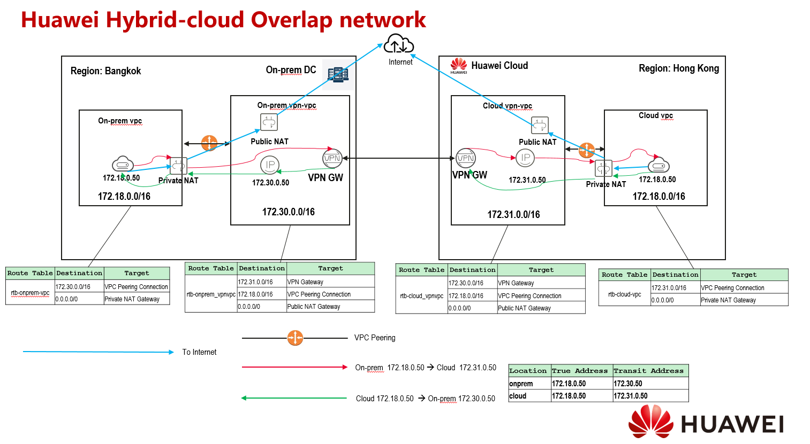
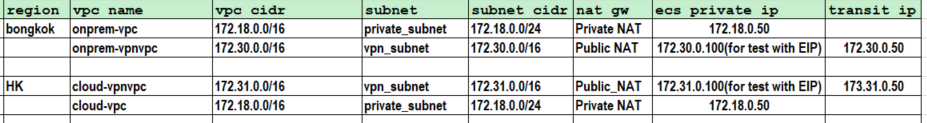
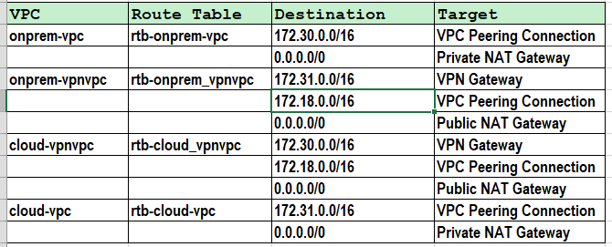
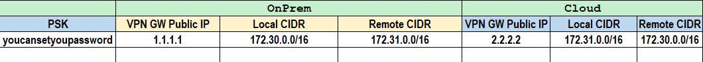
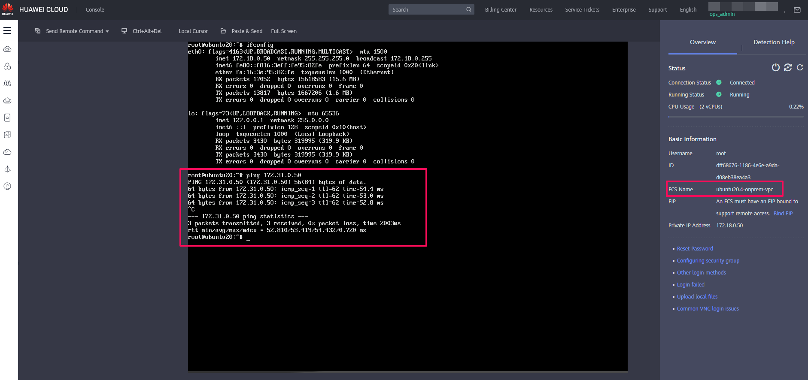
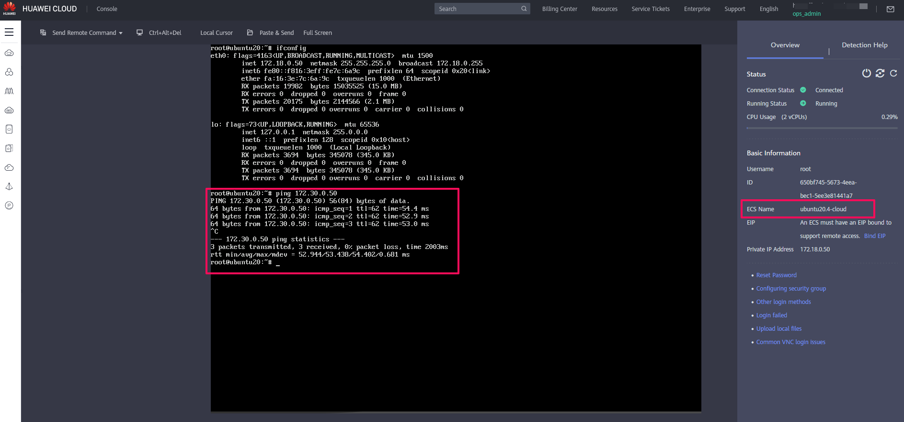

# Huawei Hybrid-Cloud Overlapping Network Segment Solution

#### 1. Scenario

This solution are not able to achieve a direct connection between 172.18.0.50（on-premises) and 172.18.0.49 (cloud) in terms of Layer 2 communication. Instead, the connection is made via the use of transit address where both sides need to be connected by their own DNAT mapping. 

The logical access of connection:
The access from on-prem (172.18.0.50) to cloud (172.18.0.49) is achieved via the DNAT mapping of transit address which is from 172.18.0.50 --> 172.31.0.50

The access from cloud (172.18.0.49) to on-prem (172.18.0.50) is achieved via the DNAT mapping of transit address which is from 172.18.0.49 --> 172.30.0.50

Through the above implementation, the communication between two overlapping network segments can be achieved.

### 2. Solution Overview

The main usage is to enable communication in between on-premises data center with Huawei Cloud VPC that have the same network segment. Based on the architecture diagram as shown below, we’re going to use transit network to establish a site-to-site VPN connection which indirectly allow the same network segments in on-premises data center and Huawei Cloud VPC to communicate with each other. The connection is implemented under the same account with two different regions, Bangkok and Hong Kong.

The final result in this walkthrough is to enable communication in between on-premises data center and Huawei Cloud VPC that have the same private IP of 172.18.0.50. In fact, this communication required an intermediary transit IP address that utilize the function of DNAT which is address translation to facilitate such communication.

Please refer to below diagram as a solution overview in this walkthrough.

### 

### 3. Main Configuration Parameter

Due to the limitation of Terraform which not support the configuration of certain resources such as site-to-site VPN and Private NAT Gateway, currently we’re not able to automate the whole process of resource provisioning. Thus, please manually configure and setup the environment by using console.

#### 3.1 VPC, Subnet, VPC Peering and NAT Gateway configuration

Main Configuration：

Route table：

#### 3.2 Site-to-Site VPN configuration

During the configuration of site-to-site VPN, there is a need to fill in the remote gateway IP address. In the case where remote VPN is pending setup and configure, you may insert a dummy remote gateway and modify once the peer VPN is established. 

#### 3.3 Connection Test

Provision the ECS resources in four newly created VPC for testing purposes. It is recommended to use console for remote login. Ensure that your ECS’s security group have an inbound rule that enable the ECS to receive ICMP packets before moving on to connection test.

In on-premises environment, remote login to ECS with private IP address of 172.18.0.50, try to ping the IP address of 172.31.0.50. You should get an echo reply. 

In Huawei Cloud environment, remote login to ECS with private IP address of 172.18.0.50, try to ping the IP address of 172.30.0.50. You should get an echo reply. 

