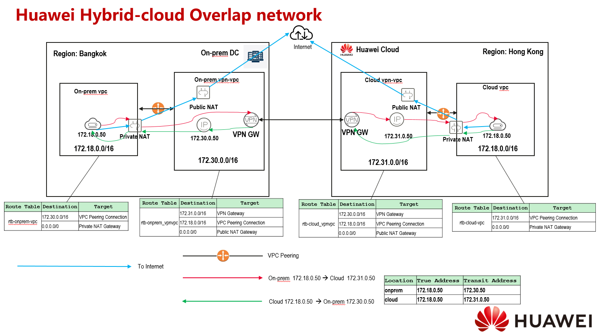
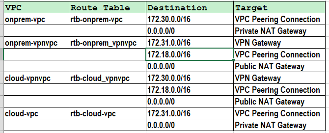
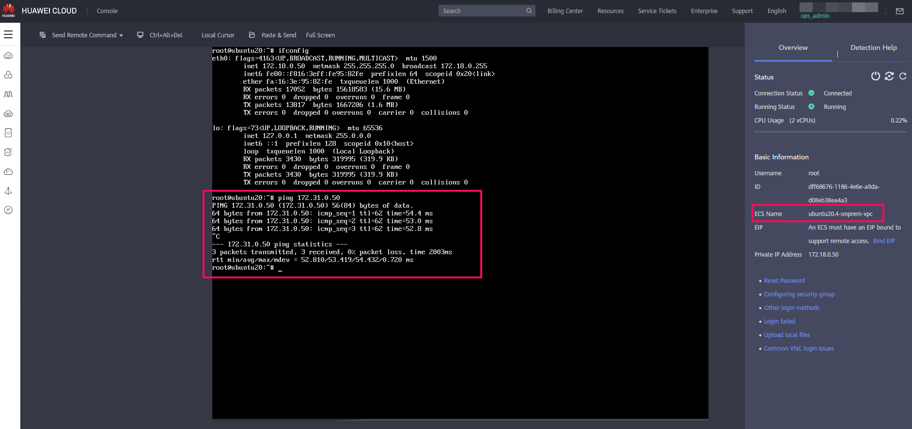

# 华为混合云网络重叠的解决方案

限制说明：

这个方案，实现的是172.18.0.50和172.18.0.49不是真正二层意义上的联通。而是通过代理地址进行的连接。需要两边通过自己的DNAT映射方式进行连接。假设场景如下：

如果on-prem是：172.18.0.50

如果cloud是：172.18.0.49

所以实现的访问逻辑是：

on-prem 172.18.0.50 --> cloud 172.18.0.49  实际上是通过172.18.0.50 --> 172.31.0.50的访问实现的。

cloud   172.18.0.49 -->  on-prem 172.18.0.50   实际上是通过  172.18.0.49 --> 172.30.0.50的访问实现的。

 通过上面的方式，实现两个重叠的网段互访。

### 1：整体架构说明

主要的使用场景是，在线上线下存在同样地址段的情况下，如何通讯，在下面的架构图里面，我们将使用Transit的Network，建立线上线下的Site To Site的VPN连接，实现两个网段的连接。下图是在同一个账号下的模拟实现。

最终实现的访问是，线上和线下的172.18.0.50和172.18.0.50进行通信。但是实际上，线上和线下需要中介的transit address实现了DNAT的地址转换，从而做到访问。

主要的模拟架构图如下：

### 

### 2: 主要配置步骤说明

整个测试环境配置流程，由于特定步骤上，现阶段无法无法所有步骤使用terraform做到自动化，例如：Site  to Site的VPN配置，还有Private NAT  Gateway，所以请使用手工配置进行实现吧。

#### 2.1 配置主要的VPC，Subnet和VPC Peering, NAT GW

主要配置表如下：

主要的路由表如下：

#### 2.2 配置Site To Site VPN

在配置我们模拟的环境时，可以先填写一个假的对端VPN Server的Public IP，配置后对端后，再回到源端更新对端的Public IP

#### 2.3 模拟测试

创建对应的ECS主机在，分别在4个VPC，进行验证测试。建议使用console进行系统登录。

在线下172.16.0.50 访问到云上172.31.0.50的验证

从云上172.16.0.50访问到线下172.30.0.50的验证

